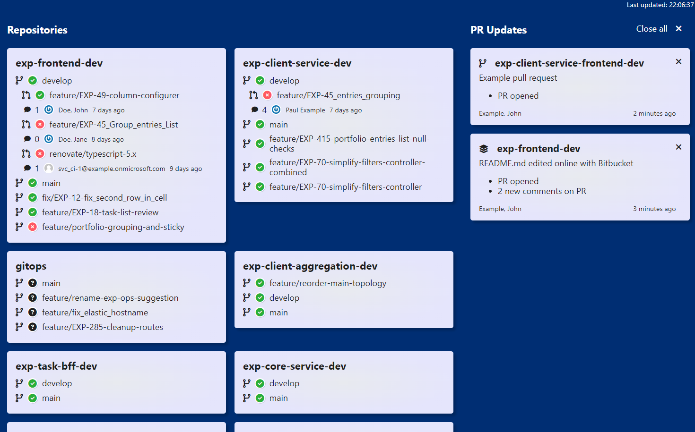

# git-server-dashboard

Git Server dashboard is a small dashboard to complement an installation of Gitlab or Bitbucket Server. It serves as a central overview over a configured set of repositories. Furthermore, it is possible to configure webhooks to it to display updates to pull requests. These updates are aggregated by pull request and can be closed individually or all at once. When a PR is updated such as through a comment, an approval or additional commits a new update will appear on the dashboard.

